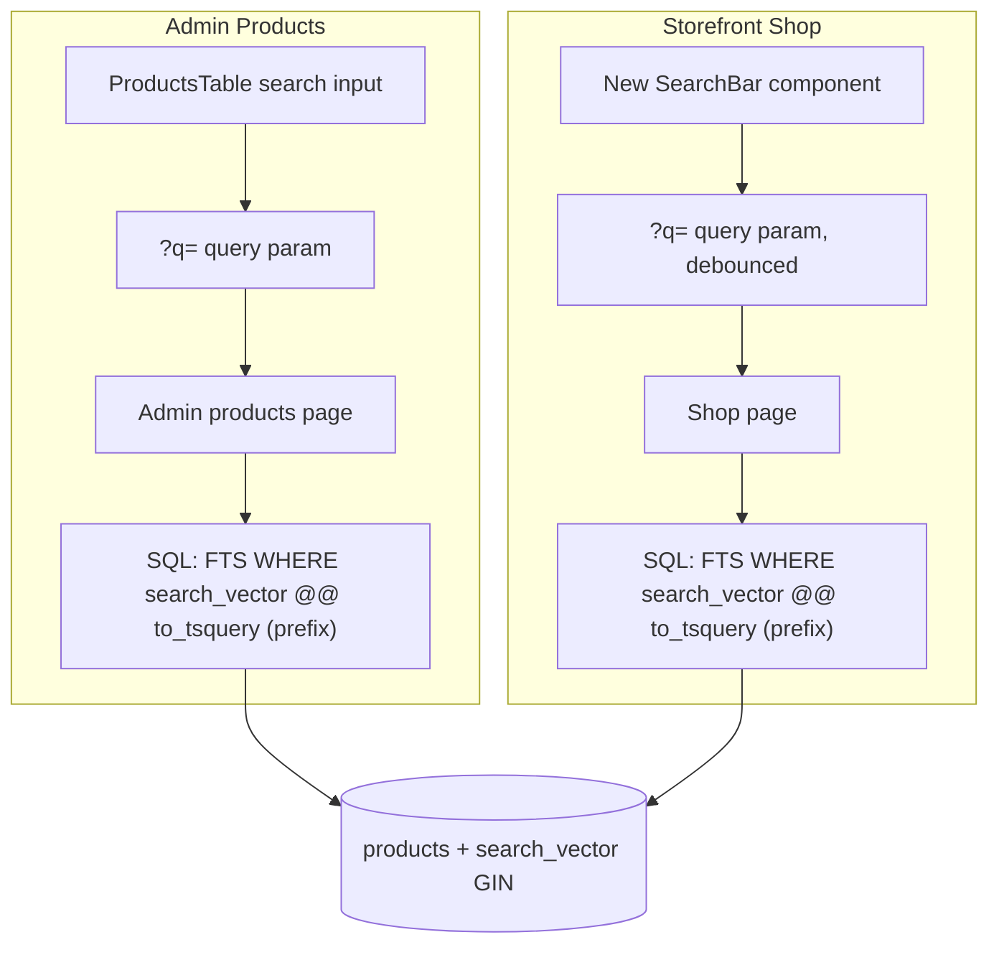

# PostgreSQL Full-Text Search Integration

## Current State


| Location                                                       | Behavior                                                                                                              | Issue                                          |
| -------------------------------------------------------------- | --------------------------------------------------------------------------------------------------------------------- | ---------------------------------------------- |
| [app/admin/products/page.tsx](app/admin/products/page.tsx)     | Fetches all products for store, filters in-memory with `name.toLowerCase().includes(q)` and `description.includes(q)` | Loads full catalog into memory; does not scale |
| [app/[storeType]/shop/page.tsx](app/[storeType]/shop/page.tsx) | No text search; only `cat` (category) and sort; FilterPanel does client-side price/size/color/subcategory             | Storefront has no product search at all        |
| [db/schema.ts](db/schema.ts)                                   | `products` table has `name`, `description`; no FTS index                                                              | —                                              |


## Architecture




---

## Implementation Plan

### 1. Database: Add FTS column and GIN index

Create migration `drizzle/0006_add_product_search_vector.sql`:

```sql
-- Add generated tsvector column for name + description
ALTER TABLE products
ADD COLUMN search_vector tsvector
GENERATED ALWAYS AS (
  to_tsvector('english', coalesce(name, '') || ' ' || coalesce(description, ''))
) STORED;

-- GIN index for fast FTS
CREATE INDEX products_search_vector_idx ON products USING GIN (search_vector);
```

**Note:** Use direct connection (port 5432) for `drizzle-kit push` per [AGENTS.md](AGENTS.md); the pooler (6543) may hang on migrations.

Drizzle schema: The `search_vector` column is generated by PostgreSQL and typically not queried directly by app code. We will not add it to [db/schema.ts](db/schema.ts) to avoid Drizzle trying to manage it; FTS queries will use raw `sql` template literals.

### 2. Shared search logic: FTS query builder (prefix matching)

Create [lib/product-search.ts](lib/product-search.ts):

- Export `buildProductSearchWhere(query: string)` returning a Drizzle SQL fragment for `search_vector @@ to_tsquery('english', $formattedQuery)`.
- **Sanitize input:** Trim whitespace. Remove special characters that break `to_tsquery` (e.g. `&`, `|`, `!`, `(`, `)`, `:`). Keep only alphanumeric, hyphen, underscore per token (e.g. `word.replace(/[^\w-]/g, '')`).
- **Format for prefix matching:** Split sanitized input by whitespace; for each token with length ≥ 2, append `:`*. Join with `&` — e.g. `"blue shirt"` → `"blue:* & shirt:*"`, `"denim jac"` → `"denim:* & jac:*"`.
- **Use `to_tsquery`:** Pass the formatted string to `to_tsquery('english', formattedQuery)` in the Drizzle SQL fragment.
- **Threshold:** Require minimum 2 characters before triggering FTS; return `undefined` (no FTS clause) for empty, too short, or fully invalid queries.

### 3. Admin Products: Use FTS instead of in-memory filter

In [app/admin/products/page.tsx](app/admin/products/page.tsx):

- When `q` is present and valid (min 2 chars): run a single `db.select().from(products).where(and(storeType, buildProductSearchWhere(q)))` instead of fetching all then filtering.
- When `q` is empty or too short: keep current behavior (no FTS, only store + category filter).
- Preserve existing category filter, variants/colors/stock aggregation, and ProductsTable props.

### 4. Storefront Shop: Add `?q` param and FTS

In [app/[storeType]/shop/page.tsx](app/[storeType]/shop/page.tsx):

- Add `q` to `searchParams` type and read from `search.cat` / `search.q`.
- When `q` present and valid: add FTS condition to `whereClause` with `and()`.
- Keep existing filters: `isVisible`, `storeType`, `cat` (category).
- No other page logic changes; ShopClient receives products as today.

### 5. Storefront UI: Search input with search-as-you-type

Add a search bar to the Shop page:

- **Placement:** Above or beside [components/UtilityBar.tsx](components/UtilityBar.tsx) in [components/ShopClient.tsx](components/ShopClient.tsx).
- **Behavior:** Controlled input, debounced (e.g. 300–400ms), then `router.push(\`/${storeType}/shop?q=${encodeURIComponent(value)}&cat=...)` to preserve existing params.
- **Clear:** When input is cleared, remove `q` from URL.
- **Component:** Create `components/ShopSearchBar.tsx` (client) or extend UtilityBar. Props: `storeType`, `initialQuery` from `searchParams.get("q")`, `onSearch` or use `useRouter` + `useSearchParams` internally.

**Search-as-you-type:** Debounce ensures we only navigate after a short pause; each navigation triggers an RSC re-fetch with the new `?q=`, so results update without a full reload.

### 6. Navbar "Search" link behavior

[components/Navbar.tsx](components/Navbar.tsx) currently links "Search" to `/${storeType}/shop` or `/shop`. Options:

- **A:** Keep as-is (navigates to shop; user uses new search bar).
- **B:** Add `?q=` with a prefocused search field (e.g. `/${storeType}/shop?focus=search` and scroll/focus in ShopClient).

Recommend **A** for minimal scope; the new Shop search bar is the main search entry point.

---

## File summary


| File                                         | Action                                         |
| -------------------------------------------- | ---------------------------------------------- |
| `drizzle/0006_add_product_search_vector.sql` | Create (migration)                             |
| `lib/product-search.ts`                      | Create (FTS helper)                            |
| `app/admin/products/page.tsx`                | Modify (use FTS when `q` present)              |
| `app/[storeType]/shop/page.tsx`              | Modify (add `q` param, FTS in `whereClause`)   |
| `components/ShopSearchBar.tsx`               | Create (debounced search input)                |
| `components/ShopClient.tsx`                  | Modify (add ShopSearchBar, pass `q` from URL)  |
| `components/UtilityBar.tsx`                  | Optional: add search slot if layout prefers it |


---

## Edge cases

- **Empty query:** No FTS; existing filters only.
- **Query < 2 chars:** Skip FTS; maintain minimum 2-character threshold.
- **Special characters:** Sanitized in Step 2 (stripped per token) so `to_tsquery` never receives unsafe input.
- **Prefix matching:** Typing `"denim jac"` matches `"denim jacket"` via `denim:* & jac:`*.
- **No matches:** Returns empty array; UI shows "No products found" (ShopClient already handles empty state).

---

## Testing

1. Run migration on dev DB; verify `search_vector` and index exist.
2. Admin: search by name/description; confirm results and performance.
3. Storefront: type in search bar; confirm debounce and URL updates; verify results and filters (cat, sort) still work.

